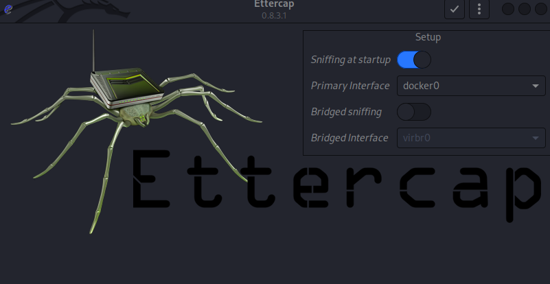
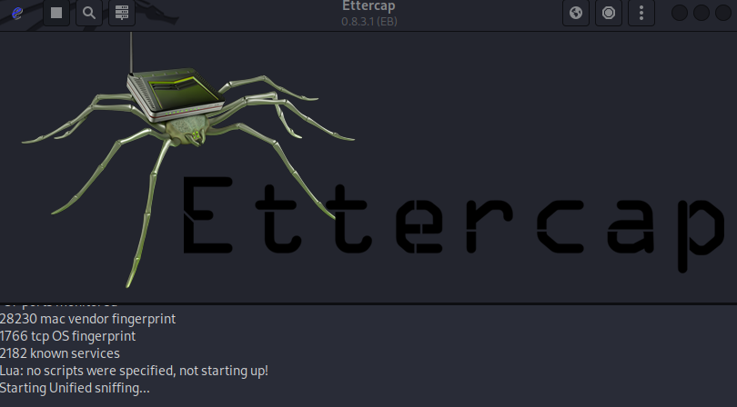
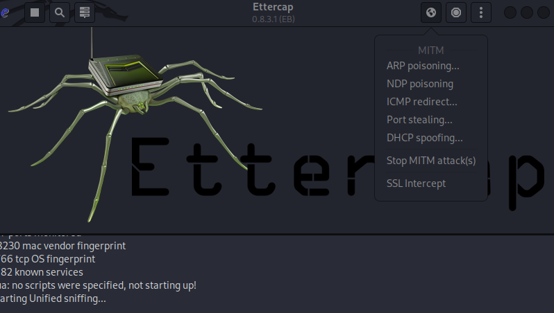
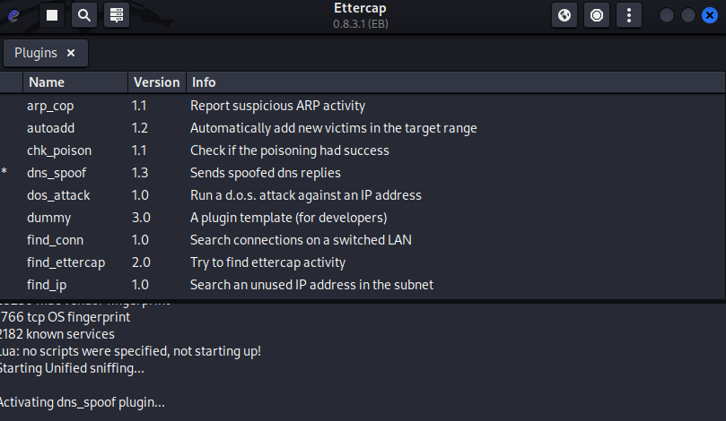

# ARP Poisoning and DNS Spoofing Lab SetUp and Attack

### Step 1: Setup Kali Linux with GUI ( in a docker container ):

[Kali container with GUI](https://www.youtube.com/watch?v=U7e-mcJdZok&t=432s)

### Step 2: Setup target machine ( in a docker container):

You'll first need to install docker.

#### On Windows: [Windows Docker tutorial](https://www.youtube.com/watch?v=XgRGI0Pw2mM)

#### On Linux: [Linux Docker tutorial](https://www.youtube.com/watch?v=cqbh-RneBlk&t=46s)

#### Building and starting the target:

```bash
cd Target
docker build -t target . 

<...SNIP...>

docker images 
REPOSITORY   TAG            IMAGE ID       CREATED          SIZE
target       latest         ddcb43d4547d   51 minutes ago   496MB

docker run -ti target /bin/bash

# You can use these 2 commands to try to reach www.google.com
curl -k https://www.google.com

/home/fool/scripts/script.py

# Or you can just watch the progress of the attack using this command:
tail -f /home/fool/scripts/did_i_get_tricked

# The cron service might take a while to start
# You can also manually start it with:
service cron start

# You can check if it's running with:
service cron status
```

**Note:** the docker commands might need to be run as root or administrator!

### Step 3: Configuring ettercap files:

#### The "/etc/ettercap/etter.conf" file should look like this: [etter.conf](ettercap/etter.conf)

#### Now to get your docker ip address:
```bash
ifconfig |grep -A1 docker|grep inet

#Ex: inet 172.17.0.1 The IP address is 172.17.0.1
```

#### Now for the "/etc/ettercap/etter.dns" will add the following lines:

```bash
google.com      A       172.17.0.1      
*.google.com    A       172.17.0.1
www.google.com  PTR     172.17.0.1

```

### Step 4: Setting up a Flask server:

You can use the web_server.py script for that. You will need to modify the IP address to match your docker IP address. You can start the server from you IDE.

### Step 5: Starting ettercap, searching for targets and performing the attack:

Because we are using a docker container as the target we need to select docker0 as our primary interface.



Press accept and scan for potential targets.



Afterwards we will select ARP poisoning from the MITM Menu.



And we will select the dns_spoof plugin from EttercapMenu -> Plugins -> Manage Plugins



We can see the result of our attack in the Flask server terminal.